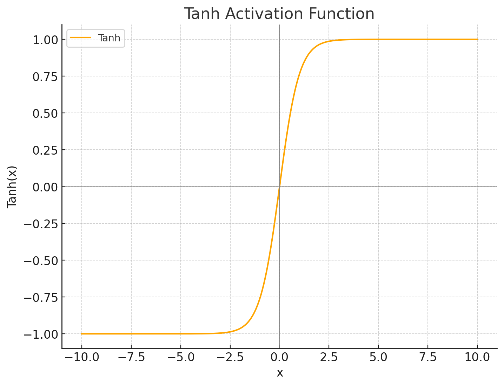
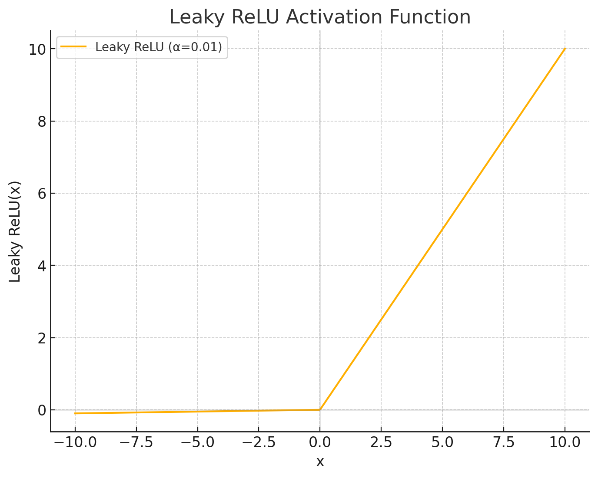

지난 포스팅까지 Gradient Descent를 시행하는 다양한 방식에 대해서 작성했다.   
이번 포스팅은 Activation Function, 활성 함수에 대해서 포스팅을 작성하겠다.

    주요 개념

> sigmoid   
> Tanh   
> ReLU, Dead ReLU   
> Leaky ReLU   
> GeLU

# 0. Activation Function들이 등장한 배경
기존 Posting에서 Activation 관련해서 언급을 한번 했었다. Hidden Layer를 많이 쌓았을 때 Layer가 쌓이는 것이 의미를 갖지 못하고 하나의 Layer로 합쳐진다. 때문에 이를 활성 함수인 Sigmoid를 통해서 0보다 컷을 경우 활성화 해주고 0보다 작을 경우 비활성화 해주는 것이다. 

# 1. Sigmoid
가장 기본적인 Activation Function이다. ( 음의 무한대, 양의 무한대 ) 사이의 실수를 (0,1)로 변환하는 일종의 확률 값을 제시하는 형태이다.

$$
\sigma(x) = \frac{e^x}{e^x + 1} = \frac{1}{1+e^-x}
$$

   
이 함수는 특정 기준을 갖고 기준 보다 클 경우 1, 작을 경우 0으로 바꿀 수 있게 해준다. 다만 input = 0 일 경우 0.5 가나온 다는 특징 또한 가지고 있다.

- Sigmoid의 미분
Sigmoid의 기울기를 구할 때 한가지 알아야할 부분은 $\sigma(x)$의 미분은 다음과 같음이다.
$$
\sigma \prime(x) = \sigma(x)(1-\sigma(x))
$$
Sigmoid의 미분 시 만약 Input x가 $-\infin \text{ 혹은 } \infin$으로 수렴할 경우 Gradient는 0으로 수렴하면서 소실되며 가장 기울기가 큰 지점은 $x=0$인 지점이다.

Sigmoid의 단점 중 하나는 Sigmoid의 기울기가 항상 0보다 크며 0.25보다 작다는 점이다. 이로 인해 아웃풋의 평균이 0.5로 생성된다. 또한 기울기가 0보다 클 경우 Back Propagation이 진행 시 Weight를 업데이트가 되지 않는다. 즉 Gradient가 소실되는 문제가 발생할 수 있다.

> 출력의 평균이 중요한 이유   
> Deep Learning Layer 중 이전 Layer의 출력이 다음 Layer의 아웃풋으로 사용되는 경우가 발생한다.
> 즉 이전 Layer의 출력이 다음 Layer의 Gradient가 되는 것이다. 이는 결국 Output의 평균은 Gradient의 평균으로 표현될 수 있다는 의미이다.

# 2. Tahn
Sigmoid보다 발전되어서 등장한 Activation Function으로 Sigmoid의 결과값 범위가 (0,1)이었다면 Tanh은 (-1,1)로 범위가 늘어났다. 이로 인해서 Tahn의 기울기 최대값 또한 1로 늘어나게 되었으며 출력값의 평균은 0이 되었다.

$$
\tanh(x) = 2 \times sigmoid(x) -1
$$

다만 여전히 Input이 양 극으로 갈 경우 Gradient가 소실되는 문제가 발생한다. 즉 Input의 절댓값이 커질 경우 생기는 문제이다. 

# 3. ReLU
Tanh로 Output의 범위를 조정해주었음에도 불구하고 여전히 Gradient가 소실되는 문제, Input의 크기가 극으로 향하면 Gradient가 0이 되어버리는 문제가 존재한다. 이를 해결하기 위해 Rectified Linear Unit, ReLU가 등장했다.   
$$
f(x) = max(0,x)\\
\\ \\
{\operatorname{d}\over\operatorname{d}x} \max(0,x) = \begin{cases}
    0 & where x<0\\
    1& where x \geq 0
\end{cases}
$$

ReLU는 Input을 0과 비교하여서 비선형성을 주는 함수가 된다. 이로 인해서 Gradient가 너무 작아서 발생하였던 Vanishing Gradient, 경사소실 문제는 발생할 확률이 적어졌다. (사라진 것은 아님.)
하지만 Input이 0보다 작을 경우 여러가지 문제들이 발생한다. 

# 4. Dead ReLU
Hidden Layer를 통해서 나온 Output이 ReLU를 거칠 때 어떤 Weight를 연산하여도 결과 값이 0이 나오는 경우를 말한다.
$$
w_0 + w_1x_1+ w_2x_2 < 0 \rightarrow \text{ReLU}  \rightarrow 0
$$
이는 결국 BackPropagation을 진행해도 업데이트 시킬 Weight가 0이 되어버려서 학습이 되지 않는 문제가 생긴다.
이를 해결하기 위해 두가지 해결방식이 등장했다.

1. ReLU 함수에서 0보다 작을 경우 0으로 만들지 않는 방식
2. $w$를 초기에 잘 설정하여서 ReLU의 Ouput 0이 되지 않도록 초기값을 잘 설정하는 방식
# 5. Leaky ReLU
Leaky ReLU는 위 방식 중 1번 방식이다.

$$
\text{Leaky ReLU}(x) = max(0,x) + \text{negative slope} \times min(0,x)\\
\begin{cases}
    x & \text{if   }  x\geq 0   \\
    \text{negaive slope}, \text{       otherwise}
\end{cases}
\\
\text{negative slope's default : }1e-2
$$

Input이 0보다 클 경우는 기존의 ReLU와 동일한 $x$ 그대로이며 0보다 작을 경우 negitve slope을 활용하여서 0이 아닌 다른 작은 값을 갖도록 조정하는 방식이다.

# 6. GeLU