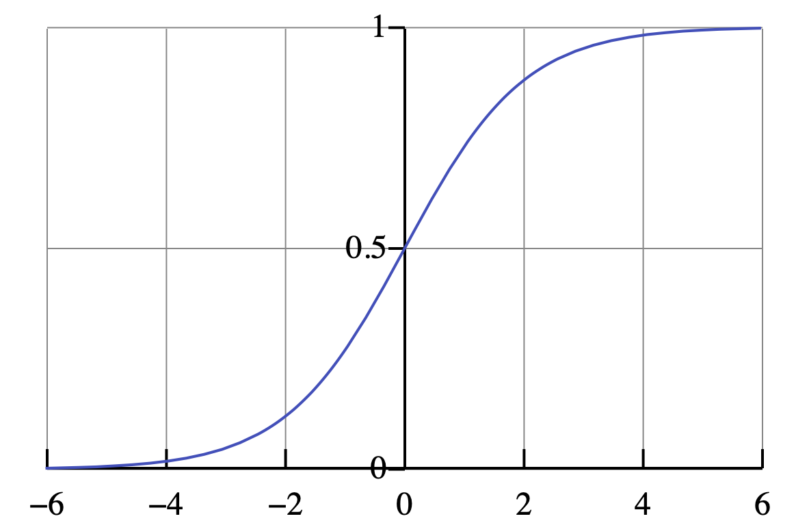

지난 포스팅까지 Gradient Descent를 시행하는 다양한 방식에 대해서 작성했다.   
이번 포스팅은 Activation Function, 활성 함수에 대해서 포스팅을 작성하겠다.

    주요 개념

> sigmoid   
> Tanh   
> ReLU, Dead ReLU   
> Leaky ReLU   
> GeLU

# 0. Activation Function들이 등장한 배경
기존 Posting에서 Activation 관련해서 언급을 한번 했었다. Hidden Layer를 많이 쌓았을 때 Layer가 쌓이는 것이 의미를 갖지 못하고 하나의 Layer로 합쳐진다. 때문에 이를 활성 함수인 Sigmoid를 통해서 0보다 컷을 경우 활성화 해주고 0보다 작을 경우 비활성화 해주는 것이다. 

# 1. Sigmoid
가장 기본적인 Activation Function이다. ( $-\infin, \infin$ ) 사이의 실수를 (0,1)로 변환하는 일종의 확률 값을 제시하는 형태이다.

$$
\sigma(x) = \frac{e^x}{e^x + 1} = \frac{1}{1+e^-x}
$$

   
이 함수는 특정 기준을 갖고 기준 보다 클 경우 1, 작을 경우 0으로 바꿀 수 있게 해준다. 다만 input = 0 일 경우 0.5 가나온 다는 특징 또한 가지고 있다.

- Sigmoid의 미분
Sigmoid의 기울기를 구할 때 한가지 알아야할 부분은 $\sigma(x)$의 미분은 다음과 같음이다.
$$
\sigma \prime(x) = \sigma(x)(1-\sigma(x))
$$
Sigmoid의 미분 시 만약 Input x가 $-\infin \text{ 혹은 } \infin$으로 수렴할 경우 Gradient는 0으로 수렴하면서 소실되며 가장 기울기가 큰 지점은 $x=0$인 지점이다.

# 2. Tahn

# 3. ReLU

# 4. Dead ReLU

# 5. Leaky ReLU

# 6. GeLU