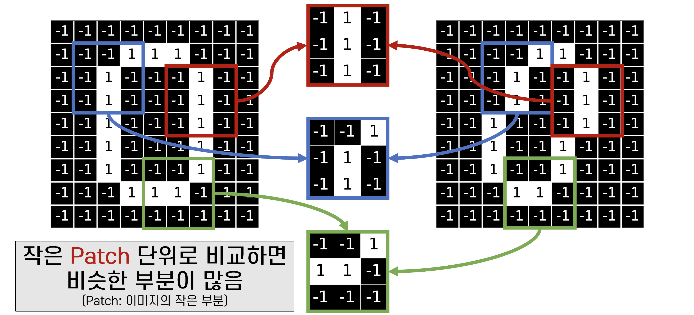

# 0. Convolution Neural Network 등장 배경

기존 MLP 구조에서 Mnist Data Set을 확인하는 과정을 생각해보자. 같은 숫자 3이어도 어떤 데이터는 3이 왼쪽 구석에 자리 잡혀 있고, 다른 데이터는 오른쪽 하단 구석에 3이 자리 잡고 있다. 그렇다면 model이 학습할 때 왼 쪽 구석에서 3을 잘 구별하게, 혹은 오른쪽 아래 자리한 3을 잘 구별하게 학습이 되어야 하며 이는 Model의 사이즈가 커지는 원인이 된다.

# 1. CNN의 작동 원리
 Mnist Data를 예시로 들자. 0을 의미하는 데이터들에 대해서 학습을 진행할 때, 특정 데이터는 0이 정자 그대로 보일 수 있고 특정 0 데이터는 한 방향으로 휘어진 상태일 수 있다. 우리는 시각적으로 두 데이터 모두 0을 표현함을 이해하지만 model 입장에서는 그렇지 않을 수 있다. pixel 단위에서 수치가 다르기 때문이다. 이를 동일하다고 인식 하기 위해서 어떤 방법론을 사용해야 할까?    
 0이 가지고 있는 특징들을 추출해서 사용하는 방식이 거론된 부분이 이 곳이다. 0을 의미하는 데이터의 pixel 단위 특징들을 가지고 연산을 진행하는 것이다.
 > 예를 들어 픽셀을 9x9 형태로 찢어서 볼 때 0을 표현하는 부분 중 좌우가 일자로 연결되어야 한다던가, 위 아래가 일자로 이어져야 한다는 등 특정 특징들을 추출하여서 이를 하나의 필터, 혹은 매트릭스화 시켜서 사용하는 것이다. 
 > 이렇게 추출한 하나의 필터로 데이터를 순회하면서 **내적값을 구한다.**  이렇게 구해진 내적 값들을 채워 간다면 원 데이터의 어느 부분이 유사한지 확인할 수 있을 것이다. 이러한 필터는 한가지만 존재하지 않고 데이터의 특징에 따라서 다양하게 존재할 것이며 이를 학습의 파라미터의 하나로서 모델이 학습하는 과정을 Convolutional Neural Network, 즉 CNN이 되는 것이다.

위 내용을 그림과 수식으로 함께 작성해본다. 아래 이미지를 볼 때 우리는 두 이미지가 의미하는 바가 0임을 이해할 수 있다. 하지만 컴퓨터는 두 이미지의 pixel 값들이 일치하지 않기에 같다고 인식하기 어렵고 해당 데이터 학습을 위해 model의 사이즈가 커지게 된다.

이를 0을 의미하는 부분의 필터 단위로서 패턴으로 구분한다면 다음과 같이 볼 수 있다.
해당 부분들이 유사한 부분을 수치화해서 모델에 학습 시키면 우리의 모델은 패턴의 유사성을 보고 이 두 데이터가 유사한 정도를 파악, 둘이 같은 의미의 0을 표현하는 데이터임을 확인할 수 있는 것이다.

그렇다면 필터를 통해 유사성을 측정하는 방식은 어떻게 진행할 것인가? 바로 filter 사이즈 만큼 데이터를 계속해서 **내적값을 구하는 방식이다.** 행렬의 내적은 본인과 유사하면 유사할 수록 그 값이 커진다는 특징이 존재한다. 데이터의 특정 부분을 필터와의 내적의 합의 평균으로 해당 부분의 유사도를 측정

이 필터를 앞으로는 **Receptive Field라고 부른다.** 현재 예시로든 사진에서는 3x3 사이즈다.

# 2.  Multi Filter
우리는 자연스럽게 필터가 다양하게 적용될 수 있다고 생각할 수 있다. 위 단락에서 처럼 0을 잘 보여주는 필터를 3개 적용한 것처럼 말이다. 이렇게 여러개의 필터를 적용하여 유사도를 확인한 매트릭스들이 필터의 갯수 만큼 나올 것이다. 우리의 예시를 갖고 생각해보면 다음과 같다.

|원본 데이터| 3x9x9 | C_in x Weight x Height|
|필터 사이즈 및 갯수| 6 x 3 x 3 x 3| Filter(C_out) x C_in x Weight x Height|
|각 필터를 기준으로 만든 유사도 map|6 x 3 x 8 x 8| Filter(C_out) x Weight\` x Height\`|
|Bias vector의 갯수| 필터와 동일한 3개|

우리는 위 과정을 데이터 셋을 가지고 진행한다. 즉 원본 데이터 하나만을 가지고 진행하는 것이 아닌 여러 데이터를 가지고 진행한다. 또한 Bias 역시 연산 과정에 들어간다.

|Iteration별 원본 데이터| N(Batch) x C_in x Weight x Height|
|필터 연산 (Conv 연산)| N(Batch) x C_in x C_out x Weight x Height + Bias(Filter 별로)|
|Output|N(Batch) x C_out x Weight\` x Height\`|

CNN Layer에서 Filter의 갯수만 Hyper Parametre의 형태로 주고 Relu Layer를 적용하면서 학습을 진행한다. 