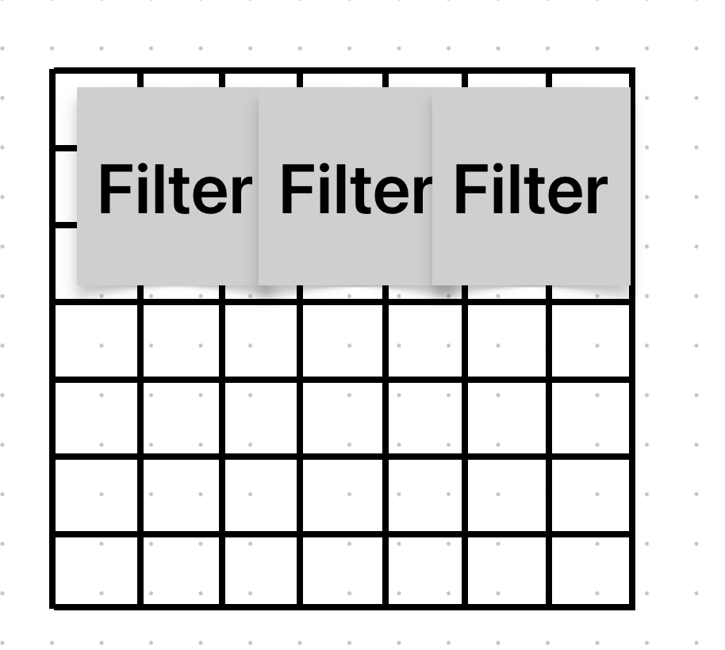
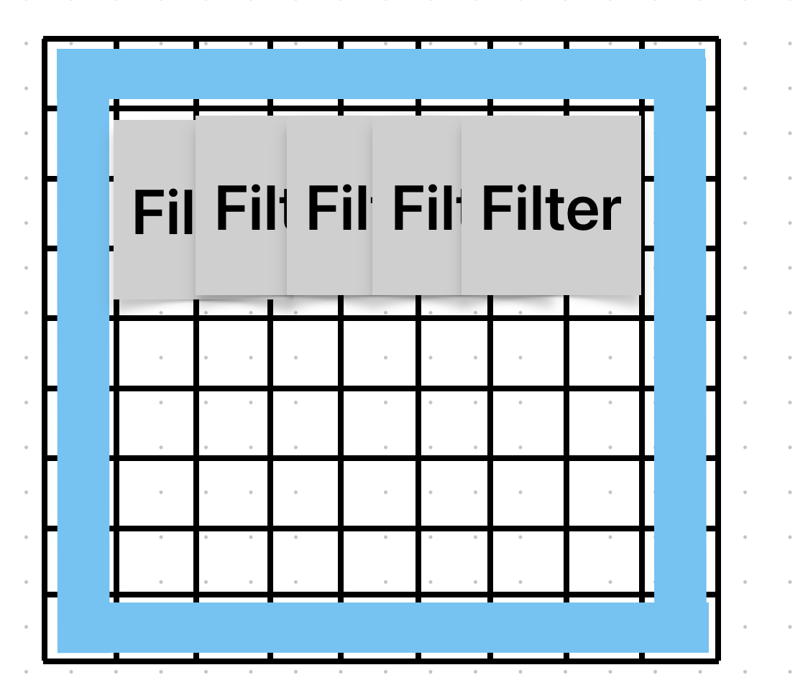
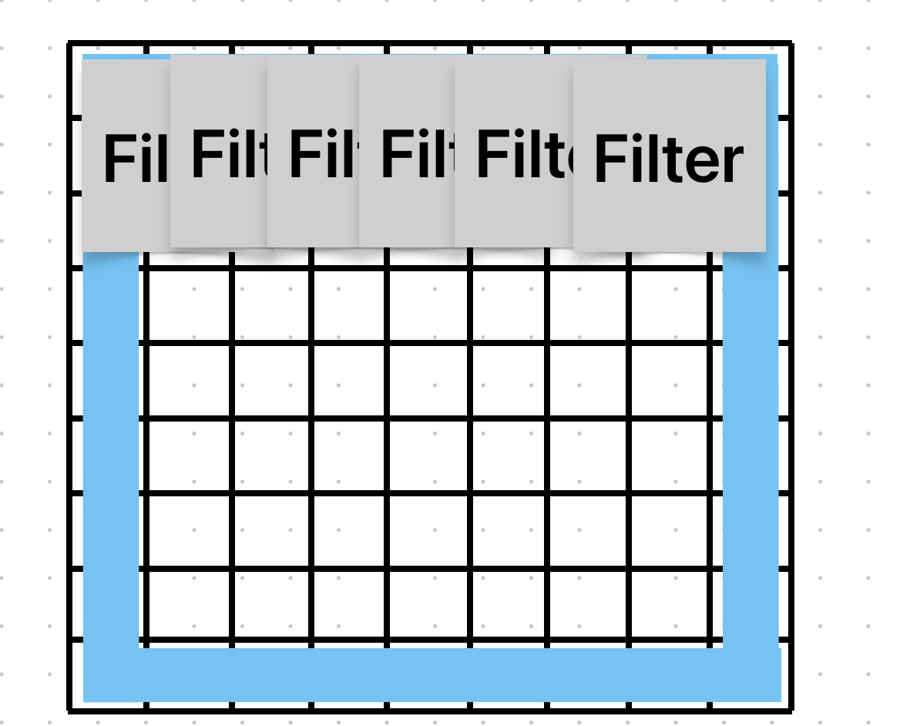
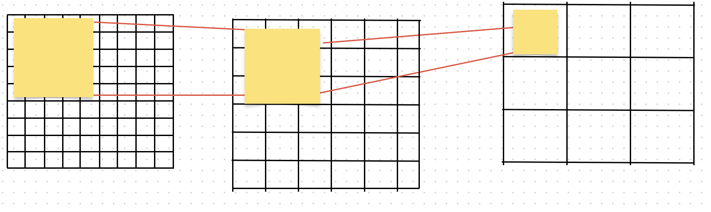
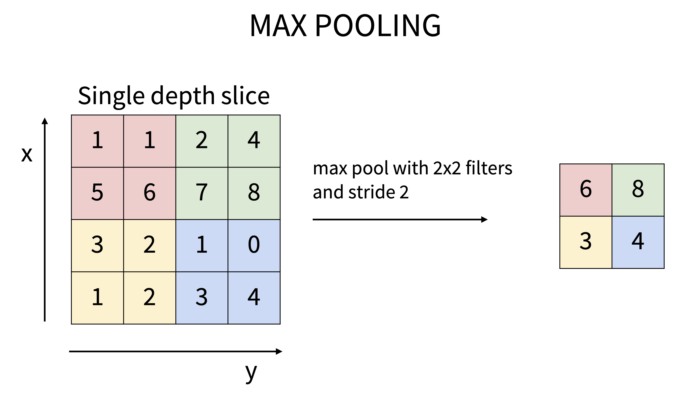

지난 포스팅으로 Convolutional Neural Network의 기본적인 연산에 대해서 작성했다.     
이번 포스팅에서는 좀 더 세분화한 Convolutional Neural Network에 대한 내용을 작성하겠다.

주요 개념

> Stride    
> Padding    
> Pooling    

# 1. Stride
원 데이터 N x N을 Filter인 F x F를 한칸 씩 이동하는 예시로 지난 시간 CNN의 기본 연산을 이야기 했다. 필터가 그 사이즈에 맞춰서 원본 데이터를 한 칸씩 이동하면서 연산하는 것이다.    
지금의 예시는 Stride가 1인 상황이다. **만약 Stride가 2라면** Filter는 원 데이터를 2칸씩 띄어 가면서 연산하게 된다.
7 x 7 원 데이터에 3 x 3 필터를 적용한다고 생각해보자. Stride가 1일 때 Output이 5 x 5로 나올 것이다. 그렇다면 Stride가 2 일 경우의 연산은 어떻게 될까?
그림으로 그려본다면 다음과 같다.

두 칸씩 이동한 결과이다. 기존에 Output이 5 x 5로 나왔던 것과 달리 3 x 3의 형태로 Output이 형성되는 모습이다.
이렇게 연산의 과정을 줄임으로써 연산의 효율이 올라가는 Stride이나 Output의 사이즈가 계속해서 줄어들기에 Conv Layer가 쌓이면 쌓일 수록 정보의 손실이 계속해서 생길 수 있다.

# 2. Padding
위의 정보 손실을 해결하기 위한 방안 중 하나로 Padding이 등장하였다.

위 예시에서 원 데이터 테두리에 파란 부분처럼 아무 의미없는 0을 갖는 Pixel을 붙여주는 것이다. 0인 Pixel을 붙여주는 것을 **Zero Padding**이라고 한다. 이를 통해서 기존에 필터와 Stride의 사용 때문에 발생한 정보의 손실을 줄일 수 있게 된다.

기존 결과물이 5 x 5으로 나왔던 것과 달리 Padding을 줌으로써 7 x 7가 되었다. Output이 담고 있는 정보가 커진 것이다.

# 3. CNN 중첩의 문제점
우리가 CNN Layer를 여러 번 쌓는다고 하였을 때 마지막 Output은 원본에서 얼마만큼의 데이터를 담고 있을까? 
9 x 9 데이터를 3 x 3 필터를 2번 통과 시킨다고 생각하면 다음과 같은 과정이 상상 될 것이다.

처음 Conv 연산을 통한 결과는 7x7 결과물이 나오며 한 칸이 3 x 3의 데이터를 담고 있다. 이  7 x 7 결과물에 다시 한번 Conv 연산을 시행 5 x 5 결과물이 나오며 이는 원본 데이터에서 5 x 5에 해당하는 데이터를 담고 있게 된다.    
무엇인가 이상함이 느껴지지 않는가? 3 x 3을 두번 연산한 결과값이 5 x 5 연산한 것과 담고 있는 데이터의 양이 같다! 이제 우리는 무엇이 더 효율적인지 생각해보아야 한다.

|필터 사이즈|파라미터 수|
|5 x 5 필터|25개|
|3 x 3 필터 2개| 9 x 2개|

3 x 3을 두 번 연산하는 과정이 학습 시 파라미터의 수가 더 적은 것을 볼 수 있다! 즉 5 x 5 연산 보다 효율이 더 좋음을 알 수 있다.

하지만 이렇게 여러 Layer로 Conv 연산을 시행하는 것에 문제점이 있다. 이전의 포스팅에서 활성함수 관련 내용을 기억하는가?

$$
h_1 = w_1x + b_1
h_2 = w_2h_1 + b_2
h_t = w_tx + b_t
$$

활성 함수 없이 Layer만 계속해서 쌓는다면 이는 결국 하나의 Layer로 연산하는 것과 크게 다르지 않다고 설명했었다. 그렇다. CNN에서도 마찬가지이다. 활성 함수 없이 계속해서 Layer를 쌓는 것은 결국 하나의 Layer를 쌓는 것과 결과값이 다르지 않다는 것이다. 때문에 우리는 ReLU와 같은 활성함수를 CNN Layer 뒤에 붙여 주는 것이다.

# 4. Depth를 줄여야할 때
우리가 학습해야할 이미지 데이터는 $\text{Height} \times \text{Weight} \times \text{Depth}$ Depth를 줄임으로서 우리는 원본 데이터의 정보를 손실 시키지 않고 사용할 수 있다. 이를 가능하게 하기 위해 1 x 1 x $\text{Depth}$ 사이즈를 갖는 필터로 Conv Layer를 사용한다. Depth는 필터의 갯수만큼 줄어들면서 우리의 원본 데이터의 정보를 그대로 갖고 있다. 또한 이렇게 Depth를 줄이는 Conv Layer를 통해 활성함수를 사용하면서 모델의 복잡성을 높이는 효과도 갖게 된다.    
> Image Segmentation Task 에서는 이미지의 모든 픽셀에 대해서 Classification을 진행하기에 1 x 1 filter를 사용하기도 한다.

# 5. Pooling
우리의 지금까지 연산을 요약해보자.

$$
\text{Input :} C_{in} \times w \times h\\
\text{Conv Layer} : C_{in} \times C_{out} \times w \times h \times k(\text{필터 갯수})\\
\text{Output} : C_{out} \times w`\times h` \times k
$$

이 연산을 진행하게 되면서 우리의 데이터는 점점 그 사이즈가 커져간다. 연산의 복잡도가 올라가면서 그 효율 또한 떨어질 것이다. 떄문에 우리는 이 커져가는 데이터를 의미를 담고 있는 작은 데이터로 나눌 방식을 생각하게 될 것이다.    
이러한 배경을 통해 등장한 것이 Pooling이다. Pooling은 원본 데이터에서 필터의 사이즈만큼을 보고 해당 부분을 대표하는 데이터로 치환하여 Conv 연산하듯이 진행한다.

## Max Pooling

각 부분을 확인해보면 가장 큰 값을 가져오는 것을 확인할 수 있다. 이렇게 가져온 데이터를 통해 연산이 진행된다. 이 과정에서 파라미터는 존재하지 않고 연산이 가능하게 되며 데이터가 계속해서 커져가는 것을 방지하는 방안으로써 사용할 수 있다.

## Average Pooling
Max Pooling에서는 최대값을 가져왔다면 Average Pooling은 해당 필터 내의 평균을 가져와서 연산을 진행한다. 이는 여러 CNN Layer거친 데이터를 FC Layer를 통해 결과값을 도출하지 않고 연산하고 싶을 때, 즉 CNN Layer만을 갖고 연산을 진행할 때도 사용한다.