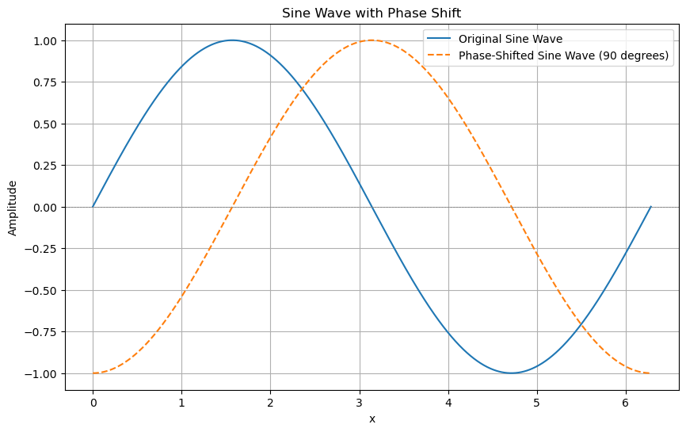
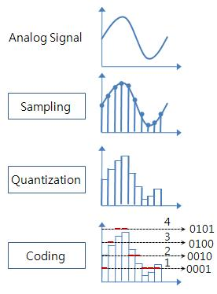

오디오 데이터 관련 처리를 위해서는 디지털 신호 처리에 대한 이해가 필요하다. 이번 포스팅부터는 오디오 데이터를 다루기 위한 디지털 신호처리 과정을 공부하겠다. 
부족한 내용도 많을 것이고 물리, 수학적 내용이 많을 것 같아 걱정이 앞서나 언제나 그렇듯 작은 단위부터 하나씩, 하나씩 쌓아간다. 

 주요 개념 

> 소리의 개념 
> 진동의 개념 
> 컴퓨터 입장에서의 소리

# 1. 소리의 개념
 우리는 살면서 계속해서 소리를 듣게 된다. 기분 좋은 음악 소리도 있을 것이며, 늦잠 자고 싶은 아침 날 깨우는 부모님의 소리, 공장에서 발생하는 기계들의 소리 등등 우리의 귀는 매일매일, 매 순간 소리를 듣게된다. 이 소리의 개념은 다음과 같이 정의 된다.

> 공기나 물과 같은 매질을 통해서 전달되는 종파.  
> 대표적으로 사람의 귀, 청각기관을 자극하여서 뇌에서 해석되는 매질의 움직임이 예이다.

즉 우리의 청각 기관에 맞닿아있는 물질, 대체로 공기가 진동하는 것을 느낄 떄 우리는 소리라고 인식하게 되는 것이다. 매질의 진동에 따라서 우리는 소리를 다양하게 인식하게 되고 음악과 같이 조화로운 소리도 듣고, 공사장 기계가 움직이는 시끄러운 소리도 듣게 된다.
그렇다면 이 진동은 대체 무엇일까? 진동에 따라서 소리가 다르게 느껴지는 것일까??

# 2. 진동의 개념
 초등 교육에서 부터 많은 과학 수업을 통해서 **진동**에 대해서 들어왔을 것이다. 무척 기본적인 내용이겠지만 다시한번 하나씩 살펴보자.

 ## 사람의 입장에서 소리
진동하면 많은 단어들이 생각날 것이다. 주파수, 진폭, 주기, 파장과 같이 수업에 배웠던 개념들 말이다. 우선 우리 보다 쉽게 와닿기 위해 물리적 개념말고 우리가 느끼는 소리에 대해서 생각해보자. 우리는 소리를 어떻게 느끼는가? 우선 소리의 크고 작음을 느낀다. 즉 소리의 크기(**Loudness**)가 존재한다. 다음으로는 같은 크기의 소리여도 음의 차이가 있을 것이다. 음의 높낮이(**Pitch**)가 존재한다. 고음을 시원하게 부르는 가수의 노래들이 기억날 것이다. 마지막으로 우리가 느낄 때 음색(**Timbre**)이 있다. 같은 크기, 같은 음을 들어도 음색의 차이가 존재하기에 우리는 같은 노래를 들어도 가수마다 차이를 느끼게 되며 취향의 차이가 생기기도 한다. 

## 물리적 영역에서 소리
 소리, 진동에서 우리가 얻을 수 있는 물리적 값은 진폭, 주파수, 위상 3가지 이다. 
 진폭은 진동의 $\text{최고점} - \text{최저점}$이다. 하나의 점이 진동하며 움직인다고 생각해보자. 그 점이 움직이는 경로에서 가장 높은 지점이 최고점, 가장 낮은 지점이 최저점이 되며 두 점의 차이가 진폭이다. **이 진폭(Amplitude)을 통해서 소리의 크기(Intensity)가 결정된다.** 진폭이 클수록 소리가 커지는 것이다.     
 다음으로 주파수는 **얼마나 빠르게 진동하는가**이다. 주파수는 "주기적인 현상이 단위시간 동안 얼마나 일어나는가?"를 의미한다. 흔히 우리가 사용하는 Hz단위는 1초를 기준으로 주기 현상이 몇 번 발생했는지를 의미한다. 어릴 때 들었던 라디오 주파수 99.1MHz 등등은 초당 99.1번 주기현상이 발생하는 것이다. 

마지막으로 위상이다. 진동에서 특정 기준이 되는 지점에서의 각도를 의미한다. 진동을 표기하기 위해서는 $\sin, \cos$파를 통해서 표현되는 경우가 많다. 아래 그림은 하나의 사인파의 위상을 90도, $\frac{\pi}{2} \text{라디안}$  만큼 이동 시킨 모습이다. 시간축 x가 2일 때 기존 사인파와 위상이 바뀐 사인파의 기울기가 다름이 보일 것이다.    

이 위상이 다르면 진동의 모양이 바뀌게 되고 같은 주파수를 갖더라도 서로 다른 Tone-color를 지니게 된다.

# 3. 컴퓨터 입장에서의 소리
지금까지 소리가 가지는 물리적 구성에 대해서 간단하게 알아보았다. 그럼 컴퓨터는 이런 소리를 컴퓨터에서는 어떻게 인지하고 처리할 수 있을까?
단순히 생각해보았을 때 아날로그 소리의 Input을 컴퓨터가 인지할 수 있게 변환해주어야 함은 이해될 것이다. 이 변환 과정은 시간축을 기준으로 구역을 나누는 **샘플링**을 진행, 진폭을 기준으로 샘플의 진폭치를 대표값으로 변경하는 **양자화**를 진행한다. 이 과정을 통해서 $\sin$파 그래프 형태에서 Bar 형태의 그래프처럼 모습이 변경된다. 이제 그래프의 각 값들을 Binary 코드의 형태로 변환해서 최종적으로 컴퓨터가 인지할 수 있게 만들어준다.

 # 참고 자료

 [위키피디아-소리](https://ko.wikipedia.org/wiki/소리) 
 [위키피디아-진동](https://ko.wikipedia.org/wiki/진동) 
 [정보통신기술용어해설](http://www.ktword.co.kr/test/view/view.php?m_temp1=978)