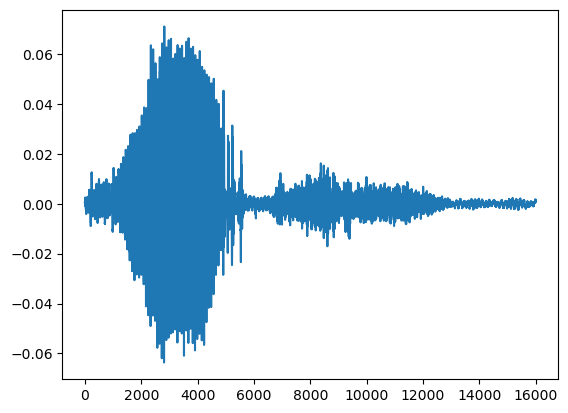
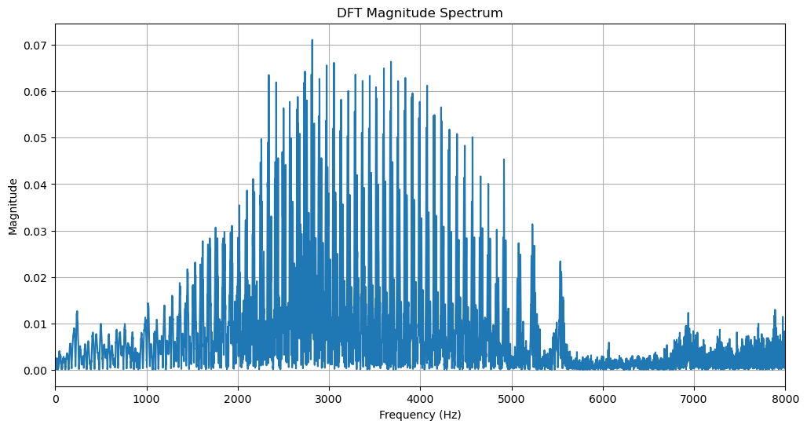
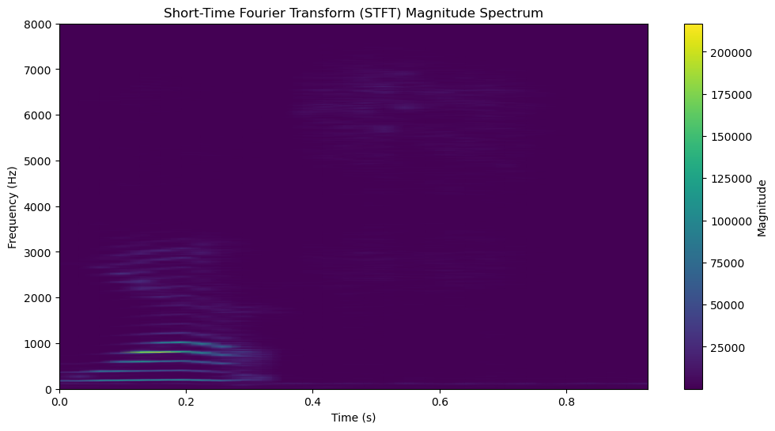

저번 포스팅으로 오디오 데이터가 어떻게 컴퓨터에서 인식되는지 간단하게 공부해보았다. <br>
이번 포스팅은 오디오 분야의 푸리에 변화에 대해서 공부한다. 정말 정말 너무 어렵게 느껴져서 이번에도 하나씩 하나씩 정리 진행해보자.

<p align=center> 주요 개념 </p>

> 정현파, 정성파, 합성파, 복합파
> 푸리에 변환(Fourier Transform)
> Descret Fourier Transform, Short Time Fourier Transform

# 1. 파형의 다양한 형태.
## 정현파
이전 포스팅에서의 마지막 이미지를 기억하는가? 하나의 $\sin$파를 위상 변환 시켜주었던 이미지다. 여기서 사용된 기본의 $\sin$파를 **정현파**라고 한다. 가장 기본형태의 $\sin$파를 의미하는 것이다. 만약 동일한 진폭, 주파수, 위상을 가지는 정현파 2개가 발생한다고 생각해보자. <br>
## 정성파
두 정현파가 만나는 지점에서 어떤 현상이 발생할까? 같은 특징을 가지는 정현파가 만난다면 기존의 진폭이 보다 강화되게 된다. 이후 서로가 만난 지점을 통과하면 각자 기존의 진폭, 특징을 그대로 가지고 지나간다. 만약 다른 특징은 같아도 위상이 서로 반대라면 어떻게 될까? 위상이 반대라면 서로의 진폭이 소실되는 것처럼 0이 된다. 마찬가지로 이 지점을 통과하면 각자의 특징을 그대로 담은 채로 다시 각자의 방향으로 진행한다. 이러한 현상을 각각 **건설적 간섭, 파괴적 간섭**이라고 한다.
이해가 어렵다면 아래의 그래프를 참고하자.


**정성파**는 정현파의 건설적 간섭에서 파생되는 파형이다. 정현파는 파동이 (에너지 감소가 없을 때) 무한히 이동하는 것을 가정하고 생각한다. 하지만 현실에서 파동은 시작점과 끝지점이 존재한다. 파동이 시작점에서 시작해 끝 지점에 닿으면 어떻게 될까? 파동이 반사되어서 시작점 방향으로 돌아올 것이다. 이렇게 돌아온 파동은 시작점에서 출발하는 파동과 만나게 되면서 **건설적 간섭**이 생긴다. 즉, 파동이 끝 지점에 반사되면서 시작점에서 출발한 파동보다 더 큰 파동이 형성되는 것이다. 이렇게 생긴 더 큰 파동을 정성파라고 한다. <br>
정성파는 **결절**과 **배음**이라는 특징을 가진다. 
| 이름 | 설명                                                   | 세부 설명                                                     |
| ---- | ------------------------------------------------------ | ------------------------------------------------------------- |
| 결절 | 정성파가 형성되면서 진동이 발생하지 않게되는 특정 부분 | 기존 파동과 반사된 파동의 위상이 반대되는 지점                |
| 배음 | 정성파 형성 시 진폭이 가장 높은 지점                   | 기존 파동과 반사된 파동의 위상이 같아 진폭이 최대가 되는 지점 |

## 합성파와 복합파
한편 우리는 세상의 소리를 하나만 인식하지 않는다. 세상에 많은 요소들이 소리를 만들어내기 때문이다. 즉 여러 정현파가 서로 결합된 파형이 존재한다. 이를 합성파 혹은 복합파라고 한다.<br>
소리의 파형들이 중첩 되서 각각의 파형을 확인할 수 없을 것 같지 않은가?? (최소한 나는 그렇게 생각했다... 어떻게 겹쳐서 들어온 소리를 각각 구분해서 인지할 수 있는지 원리가 이해가 가지 않았다.)<br>
이러한 복합파를 분석가능한 형태로 변환해주는 것이 Fourier Transform이다.

# 2. Fourier Transform
<p align = center>Pourier Transform <br>"임의의 입력신호를 다양한 주파수를 갖는 주기함수(복수의 지수함수)들의 합으로 분해하여 표현하는 것."</p>

$$
F(\omega) = \int_{-\infty}^{\infty} f(t) e^{-i \omega t} \, dt
$$

위 설명과 수식이 푸리에 변환에 대한 설명이다. (수식은 정확히는 연속 푸리에 변환)
수식에 지수함수도 등장하고 여러 함수들이 등장한다. 이해가 정말 어렵겠지만 하나씩 원론적으로 생각해보자.
<br>
우선 오일러 공식에 대해서 알아보자.
$$
\text{오일러 공식} \\
e^{i\theta} = \cos(\theta) + i\sin(\theta)
$$
오일러 공식은 지수함수는 삼각함수의 합으로서 표현될 수 있다는 공식이다. $e^{i\theta}$는 하나의 지수함수, 우변은 삼각함수들의 합이다. 오일러 공식의 증명은 따로 공부하자.....
이 "지수함수 = 주기함수들의 합"라는 공식이 갑자기 등장한 이유는 무엇일까? <br>
우리의 복잡한 소리 신호를 지수함수로 보았을 때, 푸리에 변환을 통해 다양한 주파수에서의 사인파와 코사인파로 표현할 수 있다는 것이다. 때문에 복잡하게 중첩된 오디오 신호가 있더라도 이를 주기함수들의 합으로서 항상 분해가 가능하다는 표현이다.<br> 또한 **우리는 주파수에 따른 축, 시간의 흐름에 따라 구분되었던 신호가 주파수에 따라서 구분이 가능해진다는 의미다.** 이 분이 키포인트이다.
$$\cos(\theta) + i\sin(\theta)$$ 

푸리에 변환을 통해서 우리가 갖게된 복소수를 살펴보자.우리는 $\cos$부분이 실수부를, $\sin$부분이 허수부를 표현함을 알 수 있다.
중요한 점은 이 복소수를 통해서 우리는 주파수의 강도, 위상을 얻을 수 있게 된다는 점이다.
| 부분            | 주파수에서의 의미 |
| --------------- | ----------------- |
| 복소수의 절댓값 | 주파수의 강도     |
| 복소수의 허수부 | 주파수의 위상     |

# 3. Descent Fourier Transform
위에서 공부한 푸리에 변환은 연속 신호를 대상으로 진행된다. 즉 소리, 그 자체를 대상으로 하는 변환이다. 이를 우리의 컴퓨터가 소리를 인식할 수 있게 적용한 방식이 이산 푸리에 변환, 즉 Descent Fourier Transform이다.<br>
 지난 포스팅에서 우리는 신호를 Sample_rate 단위로 나눈 이후 각 단위의 대표값으로 컴퓨터가 이해할 수 있게 이진 코드로 변환한다고 배웠다. 이렇게 구해진 이진 코드에 이진 푸리에 변환을 시행한다.
 내 블로그에서는 처음이지만 코드로 살펴보자.

 ```Python
import numpy as np
import torch
import matplotlib.pyplot as plt
from scipy.io import wavfile

filename = "data.wav"
data, sample_rate = plot_audio(filename)


def DFT(x):
    N = len(x)
    X = np.array([])
    nv = np.arange(N)

    for k in range(N):
        s = np.exp(1j * 2 * np.pi * k / N * nv)
        X = np.append(X, sum(x * np.conjugate(s)))
    return X

dftcom = DFT(data)

N = len(dftcom)
frequencies = np.fft.fftfreq(N, d=1/sample_rate)
magnitude = np.abs(dftcom)

# Plotting
plt.figure(figsize=(12, 6))
plt.plot(frequencies[:N//2], magnitude[:N//2])
plt.title('DFT Magnitude Spectrum')
plt.xlabel('Frequency (Hz)')
plt.ylabel('Magnitude')
plt.grid()
plt.xlim(0, sample_rate/2) 
plt.show()
 ```



시각화를 위한 코드를 제외하고 중요한 부분은 **파일 로드 ~ 푸리에 변환 결과 정렬** 부분이다. 로드한 파일을 waveform 형식과 sample_rate로 나누어 주고 sample_rate에서 나눠준 부분을 확인해보자.  Time Domain Signal 이미지를 보면 시간에 흐름에 따라 데이터의 진폭을 확인할 수 있다.
이제 우리의 waveform을 양자화를 진행한다. numpy에 구현된 함수를 사용해서 푸리에 변환을 시행한 결과값이 출력된다.

정리하자면 Descent Fourier Transform은 양자화를 진행한 벡터에서 진행하며 주파수를 축으로 변환함을 볼 수 있다.

# 4. Short Time Fourier Transform
 이렇게 우리는 FT을 시행한 결과 값을 얻을 수 있게 되었다. 하지만 현실에서 소리는 푸리에 변환만으로는 표현에 한계가 있다.
 - 푸리에 변환을 통한 결과값은 시간축의 정보를 얻을 수 없다.
 현실에서 많은 소리는 시간에 영향을 받는다. 음악을 들을 때 시간이 흐르면서 코드가 바뀌고, 멜로디가 바뀌기도 한다. 대화 중에도 우리는 시간에 따라서 다른 말들을 한다. 푸리에 변환은 주파수축에 따른 Magnitude(주파수의 세기)만 표현된다. 때문에 이러한 변화를 담아내기에 부족하다.

이를 해결하고자 등장한 부분이 Short Time Foureir Transform이다. 우리의 오디오 신호를 보다 작은 단위로 나눈다. (Sample_rate와는 다르다! 오해하지 말 것) 나눠진 구간 마다 푸리에 변환을 시행한다. 시간 단위를 나누어서 주파수 축을 보기에 시간의 흐름에 따른 주파수의 변화도 확인할 수 있다는 것이 STFT의 장점이다!
솔직히 이부분에서 놀랍다. 주파수 축만 확인할 수 있으니 시간을 잘개 나누어서 신호의 주파수의 변화를 살펴보려는 시도가 정말 놀랍다.

마찬가지로 코드로 살펴보자
```Python
import numpy as np
import matplotlib.pyplot as plt
from scipy.io import wavfile

# Load the audio file
filename = "data.wav"
sample_rate, data = wavfile.read(filename)

def stft(x, window_size, hop_size):
    num_windows = (len(x) - window_size) // hop_size + 1
    stft_matrix = np.zeros((window_size, num_windows), dtype=complex)
    window = np.hamming(window_size)

    for i in range(num_windows):
        start = i * hop_size
        end = start + window_size
        stft_matrix[:, i] = np.fft.fft(x[start:end] * window)

    return stft_matrix

# Parameters
window_size = 1024
hop_size = 512

# Compute STFT
stft_result = stft(data, window_size, hop_size)

# Prepare for plotting
frequencies = np.fft.fftfreq(window_size, d=1/sample_rate)
times = np.arange(stft_result.shape[1]) * hop_size / sample_rate

# Plotting
plt.figure(figsize=(12, 6))
plt.pcolormesh(times, frequencies[:window_size // 2], np.abs(stft_result[:window_size // 2, :]), shading='gouraud')
plt.title('Short-Time Fourier Transform (STFT) Magnitude Spectrum')
plt.ylabel('Frequency (Hz)')
plt.xlabel('Time (s)')
plt.colorbar(label='Magnitude')
plt.ylim(0, sample_rate / 2)  # Limit y-axis to Nyquist frequency
plt.show()

```

Stft 구현은 어려워서 GPT에게 도움 받았다. <br>
Shft 시행 시 몇가지 중요값들이 필요하다. 
| Parameter   | 내용                                                                         |
| ----------- | ---------------------------------------------------------------------------- |
| window_size | 총 데이터 샘플을 몇개의 sample이 담기도록 나눌지 정하는 값                   |
| n_fft       | 푸리에 변화에서 사용할 샘플의 갯수를 정하는 값                               |
| hop_size    | 윈도우를 얼마나 겹칠지 정하는 값, 일정한 시그널이 겹칠 수 있도록 설정하는 값 |

각각 하나씩 다시 살펴보도록 하자.
### window_size
우리는 오디오 신호를 데이터화 시킬 때 sample_rate로 변환하는 것을 이해했다. 여기서 변환한 sample_rate $\times$ 신호의 길이는 총 샘플의 수가 된다. window_size는 **총 샘플의 수를 나누어서 생각하고자 하는데 한 window에 몇 개가 담기도록 나눌지 정하는 값**이다. 예를 들어 우리의 데이터의 총 샘플의 수가 10,000개로 있다고 생각하자. 만약 window_size를 50으로 주었다면 50개의 sample이 담긴 window가 200개 생긴다. 여기서 50이 window_size가 된다.

### n_fft
window_size로 정해진 하나의 window에서 얼마만큼을 푸리에 변환할 지 정하는 값이다. 위의 예시에서 이어가자면 window 안에는 현재 50개의 sample이 들어있다. 만약 우리가 n_fft를 10으로 주었다면 window 안에서 5번 푸리에 변환을 진행하며 10개의 샘플을 변환한 결과가 나온다. <br> 다만 위 내용은 이해를 돕기 위한 예시일 뿐이며 실제로 적용할 때는 window_size와 동일한 값을 가장 많이 준다.

### hop_size
위 예시에서 window_size를 50으로 주어서 200개의 window가 생겼다. 그러나 window_size 대로 데이터를 자르게 되면 정보의 손실이 발생할 가능성이 크다. (소리는 시간의 흐름에 따른 정보이기에 이를 중간에 끊으면 시간의 흐름이 끊기며 정보가 손실될 수 있다.) 때문에 우리는 window를 일정 부분을 겹치면서 정보 손실을 방지한다. 대체적으로 window_size의 절반을 겹치게 만든다.(hop_size를 조절해주는 것 역시 가능하다.) 동일한 예시로 설명할 때 window_size가 50, hop_size가 25로 설정된다면 window는 399개 생성된다.


어렵지만 하나하나 개념 정리 느낌으로 생각하며 곱씹읍시다. 평안하십시오.