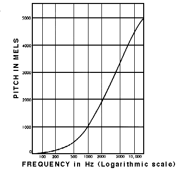

이전 두 포스팅에서 소리의 데이터로의 변환 과정, 파형의 종류, 푸리에 변환을 통한 복합파의 분리에 대해서 공부했다. 
이번 포스팅은 오디오 데이터를 인간의 인지기관에 보다 알맞게 변환해주는 Mel-Filter bank에 대해서 정리한다.

> 저번 포스팅에서 조금 타이트하게 공부해서 힘들겠지만 이번 포스팅 내용도 차근히 정리합시다. 비교적 내용은 적습니다.

 주요 개념 

> 인간 청각의 특징
> Mel-Scale
> Mel-Filter bank

# 1. 인간 청각의 특징
잠깐 인간이 소리를 듣는 과정에 대해서 알아보자.  
> 청각은 $\text{소리 발생} \rightarrow \text{귓바퀴} \rightarrow \text{외이도} \rightarrow \text{고막} \rightarrow \text{귓속뼈} \rightarrow \text{달패이관} \rightarrow \text{청각 세포} \rightarrow \text{청각 신경 경로}$를 따라서 진행된다.
> 귓바퀴에 모인 음파가 외이도로 들어가서 고막(귀청)을 진동시키면, 이 진동은 가운뎃귀의 청소골에서 진동이 증폭되어 속귀의 달팽이관의 난원창에 전해지고, 난원창의 진동이 림프액에 전달되어 청세포를 흥분시킨다. 그리하여 청세포의 흥분이 청신경에 의해 대뇌에 전달되면 소리를 느끼게 된다.

[참고 : 위키피디아-청각](https://ko.wikipedia.org/wiki/청각)

이러한 청각의 과정을 통해서 느껴지는 소리는 사실 세상에 있는 모든 소리를 담지는 않는다. 청각 기관의 물리적 특성, 신경의 신호처리 등등 복합적인 이유를 통해서 인간은 20Hz ~ 20KHz 범위의 주파수만 들을 수 있다. 예전에 한참 유행했던 인간은 들을 수 없는 주파수를 스마트폰 스피커에서 출력, 모기와 같은 해충을 쫓아내는 어플, 청각 테스트 등에서 인간 가청 주파수를 활용한 것 처럼 보이는 것들을 볼 수 있었을 것이다. 이처럼 인간은 듣지 못하지만 존재하는 주파수 대역들이 존재한다.  
또 한 가지 생각할 점은 인간의 청각이 주파수에 따라 비선형적으로 작용함이다. 보다 깊은 내용의 생물학적, 물리적 특징이 있겠으나 우리가 살펴봐야할 점은 인간은 고주파수의 변화보다 저주파수의 변화에 대해서 더 민감하게 반응한다는 점이다. 다시 말하면, 500Hz에서 1000Hz로의 변화는 민감하게, 더 잘 반응하지만 10,000Hz와 10,500Hz로의 변화는 잘 구분하지 못한다는 것이다.

# 2. Mel-Scale
뜬금 없이 인간 청각의 특징을 설명한 이유가 무엇일까? 
인간이 모든 주파수에 대해서 선형적으로 반영하지 않는다면 우리의 오디오 신호도 인간이 인지하는 방식에 따라서 변환시켜주는 것이다.
따라서 오디오 신호의 주파수를 직접 변환하거나 다루는 것이 아닌 인간이 인지 가능하게 변환하는 Mel-Scale을 사용해서 적용하는 것이다. 
Mel-Scale은 동일한 차이를 갖는 저주파수와 고주파수를 동일하게 느낄 수 있도록 측정하기 위해서 등장한 단위이다. 
인간이 하향하는 소리의 스케일을 들으면서 다양한 주파수의 소리를 듣고 실질적으로 동일한 거리만큼 떨어져 있다고 인지한 주파수를 기준으로 Scaling을 진행한 것이다.

주파수를 Mel-Scale로 변경함은 저주파수 영역에서 보다 민감하게 반응하고 고주파수 영역에 대해서 보다 둔감하게 반응하는 인간의 청각을 반영한 방식이다. 이후 계속해서 나올 Mel-Spectrum은 주파수의 단위를 

# 3. Mel-Filter bank
