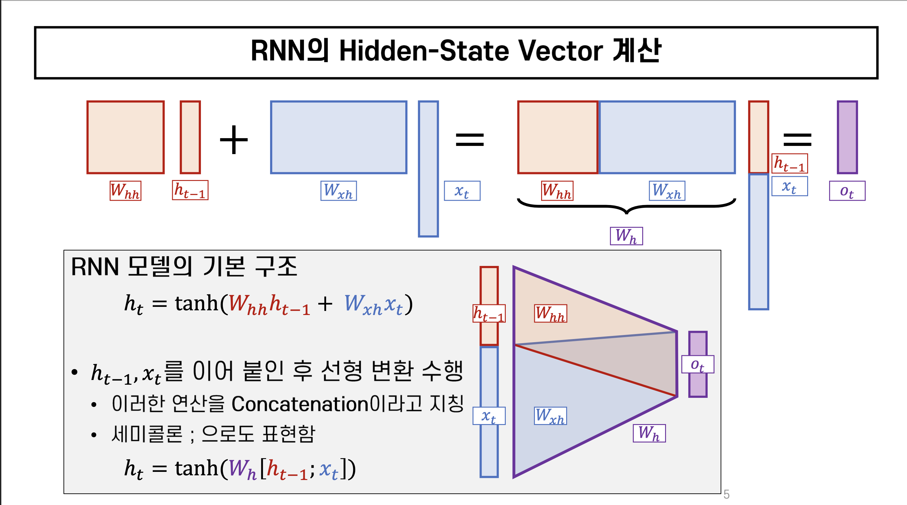

이번에는 Recurrent Neural Network에 관한 포스팅이다.    
이전에 배웠던 CNN이 이미지 데이터처리에 활용되는 구조라면, RNN은 순서를 가지는 데이터처리에 활용되는 구조이다.

주요 개념

> Recurrent Neural Network의 개념 
> Rolled / UnRolled RNN

# 0. Time Step
데이터 중에는 순서가 존재하는 것들이 있다. 간단한 예시로 자연어를 예시로 들 수 있는데, 
> 나는 학교에 간다.  
> I go to school

동일한 의미의 두 문장에서 주어 없이 동사가 나오거나 문장에 어순이 맞지 않는다면 우리는 이를 잘못된 문장이라고 생각한다. 
이는 문장은 각 단어의 연결이 중요하고 각 문장의 위치, 순서에 따라서 그 의미가 바뀌기도 하는 이유이다. 
Deep Learning에서 이러한 문제를 풀어나가기 위해서 Sequence 자료를 입력 받음으로써 출력한다.

# 1. Recurrent Neural Network
Sequence modeling은 순서의 영향을 받는 데이터를 가지고 예측을 진행하는 것이다. 
$$
\text{Input : }x_t \rightarrow f_w \rightarrow h_t \rightarrow y_t
$$

$x_1$이 최초의 input으로 {f_w}를 통과한 연산 $h_1$과 
결과값 $y_1$이 나왔다. 그 이후 $x_2$를 입력받을 때 이전 연산인 $h_1$을 같이 입력값으로 주는 연산이다. 즉 이전 Hidden State와 현재의 Input을 넣어서 현재의 Hidden State가 연산되는 것이다. 

$$
h_t = f_{\theta}(h_{t-1},x_t) = \text{Activation Function}(w_1h_{t-1} + w_2x_t)\\
h_t = \tanh(W_{hh}h_{t-1}+W_{xh}x_t) \\
y_t = W_{hy}h_t
$$

복잡한 연산으로 보일 수 있으나 위 수식의 가장 중요한 점은 매 출력값이 나오기 위한 가중치를, FC Layer를 통과하기 이전의 가중치를 다음 연산에 같이 연산을 진행하는 것이다.

$$
h_t = \tanh(W_h[h_{t-1};x_t])
$$

RNN에서 동작 시 Input x와 이전 연산에서 들어온 가중치 $h_{t-1}$를 concat, 연산 자체에 들어가는 W를 연산하는 것이다. 이를 통해 새로운 $h_t$가 생성하는 것이다.

# 2. Vanishing Gradient with RNN
RNN 구조에서 Back Propagation을 진행할 때 몇가지 문제가 발생한다.
제일 처음을 제외한 Weight들은 모두 처음 Weight를 참조하게 된다. 위에서 언급했든 RNN에서 Weight의 연산 방식은 Tanh 함수를 사용하는데 이 Tanh 함수의 기울기 최대값은 $\frac{1}{2}$이다.

$$
h_1 = \tanh(ah_0 + bx_0 + \text{bias})\\
h_2 = \tanh(ah_1 + bx_1 +\text{bias})\\
h_3 = \tanh(ah_2 + bx_2 + \text{bias})
$$
이를 통해 $\operatorname{d}\!\text{Loss}\over\operatorname{d}\!h_1$를 구해야한다. BackPropagation의 Chain Rule에 따라 이는 치환된다.

$$
{\operatorname{d}\!\text{Loss}\over\operatorname{d}\!h_1}\\
= {\operatorname{d}\!h_2\over\operatorname{d}\!h_1} \times {\operatorname{d}\!Loss\over\operatorname{d}h_2}
$$

이러한 연산이 수없이 많이 존재할 때, Tanh의 미분 최대값이 등장한다. Tanh 함수 미분의 최대값은 $\frac{1}{2}$이기에 아래 수식이 성립하게 되다.

$$
\frac{1}{2} \times {\operatorname{d}\!Loss\over\operatorname{d}h_2} \rightarrow \frac{1}{2} \times \text{a}
$$

위 수식은 h_1과 